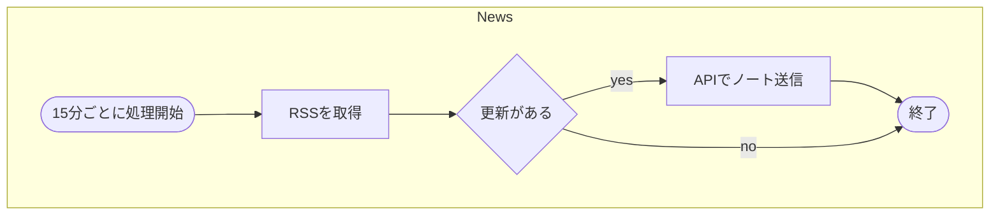
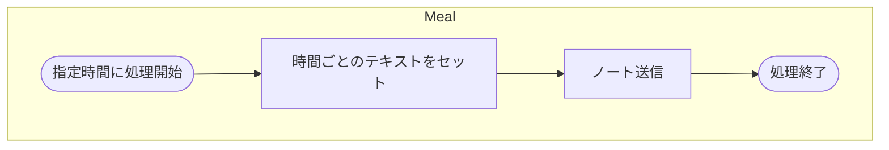

# ポケモンスリープのニュース通知Botを作る

## 要件

- ニュースの更新を通知
- カビゴンのごはんの時間を通知
  - 朝： 06:00, 11:30 :green_salad:
  - 昼： 12:00, 17:30 :cake:
  - 夜： 18:00, 05:30 :curry:

## Flow

### ニュース更新通知

### ごはん時間通知

## Ref

深く感謝

- [mistems/github-nontifier-forMisskey](https://github.com/mistems/github-nontifier-forMisskey)
- [スクレイピング結果をRSS形式にしておく #スクレイピング - Qiita](https://qiita.com/sakamossan/items/63008c2fe046a57bcc6c)
- [Node.jsで定期実行メモ #JavaScript - Qiita](https://qiita.com/n0bisuke/items/66abf6ca1c12f495aa04)
- [【Linux】Node.jsをSystemdに登録しデーモン化する - 中堅プログラマーの備忘録](https://www.chuken-engineer.com/entry/2022/09/22/103500)
- [JavaScriptでスクレイピングは可能？環境構築やコードも紹介 - プロエンジニア](https://proengineer.internous.co.jp/content/columnfeature/21159)
- [Node.js に fetch がやってきた](https://azukiazusa.dev/blog/node-js-fetch/)
